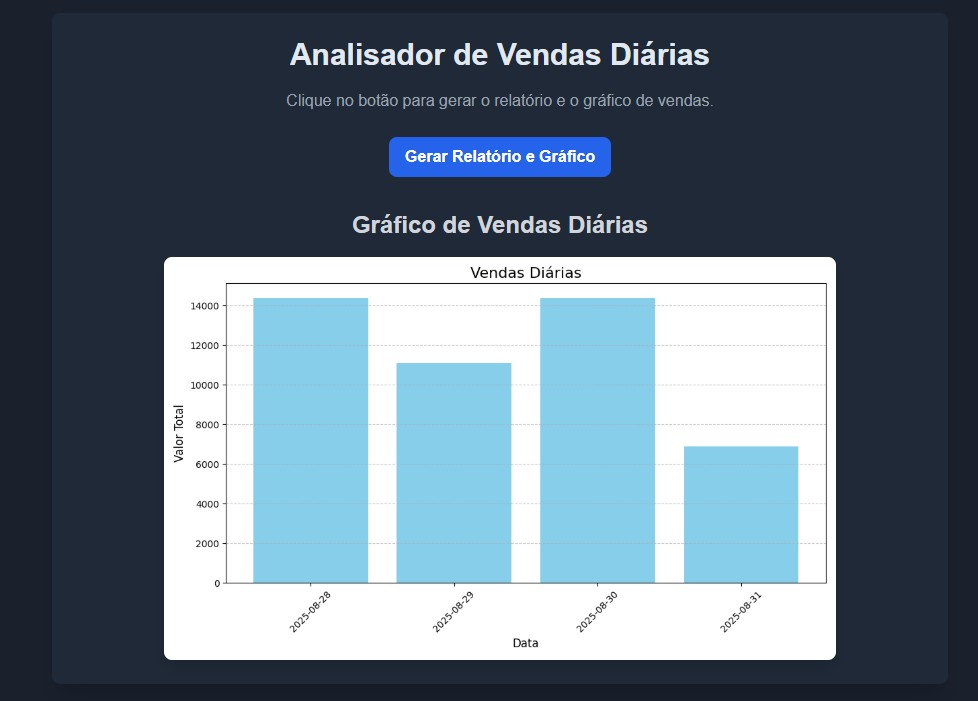

Gerador e Analisador de Vendas 📊
Sobre o Projeto

Este projeto é um Gerador e Analisador de Vendas, que simula o trabalho de um analista de dados: pegar dados brutos, processá-los e transformá-los em informações úteis para o negócio.

Ele funciona em três etapas principais:

Extração de Dados
Utiliza SQLite para criar uma tabela de vendas com dados de exemplo, simulando a extração de dados de um banco real.

Processamento e Análise
Com Pandas, o projeto lê os dados do banco de dados e calcula métricas importantes, como o total de vendas diárias.

Visualização e Comunicação
O projeto gera:

Um relatório em CSV (relatorio_vendas.csv)

Um gráfico de barras em PNG (grafico_vendas.png) usando Matplotlib, facilitando a interpretação dos dados.

📂 Estrutura do Projeto
Pipeline-De-Dados-Vendas/
│
├─ assets/                # Imagens e recursos
├─ templates/             # HTML do Flask (se usar versão web)
│   └─ index.html
├─ app.py                 # Servidor Flask
├─ gerador_relatorio.py   # Script principal
├─ relatorio_vendas.csv   # Arquivo CSV gerado
├─ grafico_vendas.png     # Gráfico gerado
├─ vendas.db              # Banco SQLite
├─ requirements.txt       # Dependências Python
└─ README.md

🛠️ Tecnologias Utilizadas

Python: Linguagem principal do projeto

Pandas: Manipulação e análise de dados

Matplotlib: Criação e exportação de gráficos

SQLite3: Banco de dados local para simular dados reais

Flask (opcional): Para rodar o projeto como web app

📊 Demonstração

Gráfico de Vendas Diárias

Relatório CSV

🚀 Como Rodar o Projeto
1. Pré-requisitos

Python instalado

Ambiente virtual criado (opcional, mas recomendado)

2. Instalação das Bibliotecas

Ative seu ambiente virtual e instale as dependências:

pip install -r requirements.txt

Se não tiver requirements.txt, instale manualmente:

pip install pandas matplotlib flask

3. Executando localmente
Opção 1: Apenas o script
python gerador_relatorio.py

Após rodar, serão criados:

relatorio_vendas.csv

grafico_vendas.png

Opção 2: Web App com Flask
python app.py

Abra no navegador:

http://127.0.0.1:5000/